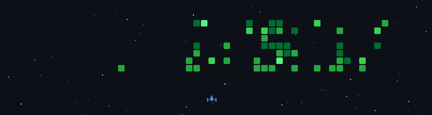

<h2 align="center">🎮 My GitHub Activity Game</h2>

  

  

  
  

 

<h2 align="center">👋 Welcome to My GitHub Universe</h2>

  

 

<h2 align="center">🚀 About Me</h2>

💻 Full-Stack Developer passionate about crafting scalable web applications 
🤖 Exploring AI, Algorithms, and Systems Engineering 
🌐 Skilled in MERN Stack, PostgreSQL, and modern tooling 
🎨 Focused on intuitive, responsive, high-performance UI/UX 

 

<h2 align="center">🌎 Connect With Me</h2>

  
  
  
  

  
  

 

<h2 align="center">⚒️ Tech Stack</h2>

<h3 align="center">🔹 Programming Languages</h3>

  
  
  
  
  
  
  

<h3 align="center">🔹 Developer Tools</h3>

  
  
  
  
  
  

<h3 align="center">🔹 Frontend</h3>

  
  
  

<h3 align="center">🔹 Backend & Frameworks</h3>

  
  

<h3 align="center">🔹 Databases</h3>

  
  

<h3 align="center">🔹 Libraries & Frameworks</h3>

  
  
  

 

<h2 align="center">📈 Contribution Graph</h2>

  

 

 <h2  align="center">💼 Stats & Insights</h2>
    
  

    
  

  
  

    
    
  

  
  

    
    
  

 

<h3 align="center">Thanks for visiting — let's build something awesome together! 🚀✨</h3>

  

